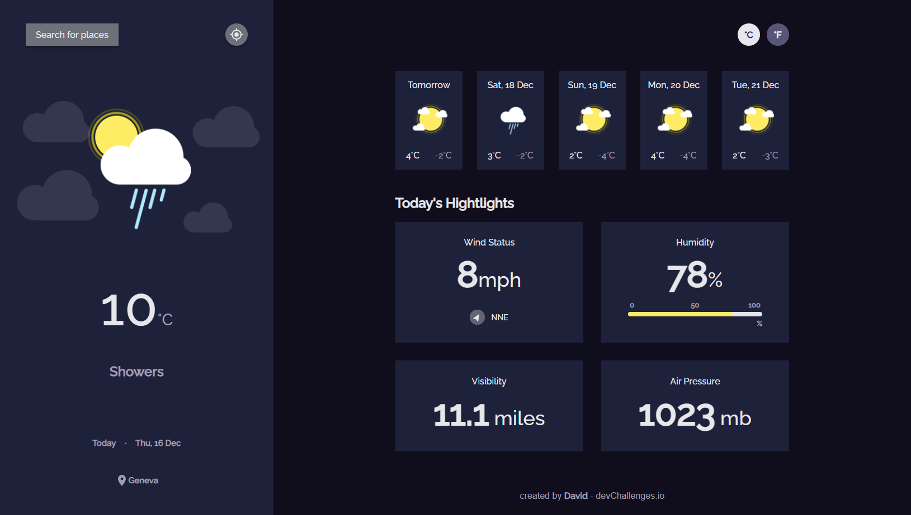

<!-- Please update value in the {}  -->

<h1 align="center">Weather App</h1>

<div align="center">
   Solution for a challenge from  <a href="http://devchallenges.io" target="_blank">Devchallenges.io</a>.
</div>

<div align="center">
  <h3>
    <a href="https://unruffled-fermi-18e89f.netlify.app/">
      Demo
    </a>
    <span> | </span>
    <a href="https://devchallenges.io/challenges/mM1UIenRhK808W8qmLWv">
      Challenge
    </a>
  </h3>
</div>

<!-- TABLE OF CONTENTS -->

## Table of Contents

-   [Overview](#overview)
    -   [Built With](#built-with)
-   [Features](#features)
-   [How to use](#how-to-use)
-   [Contact](#contact)

<!-- OVERVIEW -->

## Overview



-   Where can I see your demo?
    You can see my demo right here :D : https://unruffled-fermi-18e89f.netlify.app/
-   What was your experience?
    I've already done some Web projects, but not as big as this one. They were mainly "small" projects, each were focusing on a specific feature.
-   What have you learned/improved?
    I learned to build a website with React from A to Z, which is completly responsive and overall good looking.
    I learned how to share states between different components with Redux.
    I learned how to do API calls while handling loading state.
    I learned that I could build something great by just trusting myself a little bit :D
-   Your wisdom? :)

### Built With

<!-- This section should list any major frameworks that you built your project using. Here are a few examples.-->

-   [React](https://reactjs.org/)
-   [Redux](https://redux.js.org/)
-   [Sass](https://sass-lang.com/)

## Features

<!-- List the features of your application or follow the template. Don't share the figma file here :) -->

This application/site was created as a submission to a [DevChallenges](https://devchallenges.io/challenges) challenge. The [challenge](https://devchallenges.io/challenges/mM1UIenRhK808W8qmLWv) was to build an application to complete the given user stories.

-   User story: I can see city weather as default, preferably my current location
-   User story: I can search for city
-   User story: I can see weather of today and the next 5 days
-   User story: I can see the date and location of the weather
-   User story: I can see according to image for each type of weather
-   User story: I can see the min and max degree each day
-   User story: I can see wind status and wind direction
-   User story: I can see humidity percentage
-   User story: I can see a visibility indicator
-   User story: I can see the air pressure number
-   User story(optional): I can request my current location weather
-   User story(optional): I can convert temperature in Celcius to Fahrenheit and vice versa

## How To Use

<!-- Example: -->

To clone and run this application, you'll need [Git](https://git-scm.com) and [Node.js](https://nodejs.org/en/download/) (which comes with [npm](http://npmjs.com)) installed on your computer. From your command line:

```bash
# Clone this repository
$ git clone https://github.com/david-dkp/WeatherApp

# Install dependencies
$ npm install

# Run the app
$ npm start
```

## Contact

-   Website [dekeuwerdavid.fr](https://dekeuwerdavid.fr)
-   GitHub [@david-dkp](https://github.com/david-dkp)
-   LinkedIn [David Dekeuwer](https://www.linkedin.com/in/david-dekeuwer-1940a01b9/)
